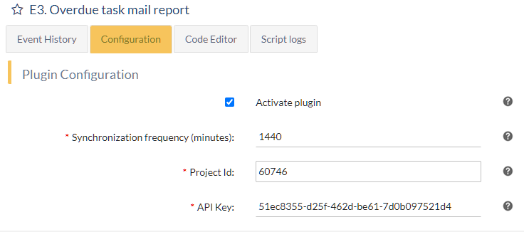

# ITM Platform's Plugin Script. Example 3
## Send a daily report of tasks whose end date is later than today

This example illustrates how to use [action conditionals](https://github.com/itmplatform/plugin-documentation#action-conditionals), [authentication](https://github.com/itmplatform/plugin-documentation#obtaining-the-itm-platform-authentication-token), [REST calls](https://github.com/itmplatform/plugin-documentation#action-restcall), [interpreter variables](https://github.com/itmplatform/plugin-documentation#variables), [scheduler frequency](https://github.com/itmplatform/plugin-documentation#synchronization-frequency-name-synchronizationfrequency)

If you haven't done so, it is recommended that you read more basic examples first.

The full code is in the `e3-overdue-tasks-email-report.json` JSON file included in this same folder, but there is also a variation in `e3.1-overdue-task-email.json`

### Desired functionality

The plugin has to send to the project manager of a particular project a daily report of all tasks whose end date has passed (earlier than today).

We will focus on the `features`, and the `configuration` that is relevant for this particular case.

We already covered the [Plugin General Definition](https://github.com/itmplatform/plugin-documentation#plugin-general-definition) in previous examples and the [plugin configuration](https://github.com/itmplatform/plugin-documentation#plugin-configuration) basic configuration in past examples.

## Configuration

Aside from the activation, we need to allow configuring the following features:

- The API Key, so the plugin user can specify whose credentials the plugin is going to use.
- The project ID of which we want to get the tasks from.
- The frequency at which we want to generate the report.

It will look like this for the plugin user



### Project Id and API Key

There are values that we need to gather once and we will use throughout the plugin script.
```json
 {
    "name": "projectId",
    "label": {
        "en": "Project Id",
        "es": "Id de proyecto",
        "pt": "Id do projeto"
    },
    "tooltip": {
        "en": "You can find the id at the end of the project's url. https://app.itmplatform.com/<CompanyName>/UserPages/ProjectGeneral.aspx?pid=60746",
        "es": "Puede encontrar el identificador al final de la URL del proyecto. https://app.itmplatform.com/<CompanyName>/UserPages/ProjectGeneral.aspx?pid=60746",
        "pt": "Você pode encontrar o id no final da url do projeto. https://app.itmplatform.com/<CompanyName>/UserPages/ProjectGeneral.aspx?pid=60746"
    },
    "type": "string",
    "required": true
},
{
    "name": "apikey",
    "label": {
        "en": "API Key",
        "es": "API Key",
        "pt": "API Key"
    },
    "tooltip": {
        "en": "API Key of the user who will be authenticated.",
        "es": "API Key del usuario que se autenticará",
        "pt": "API Key do usuário que será autenticado."
    },
    "type": "string",
    "required": true
}
```
These two values will be available in the `config` object in the script.

### Synchronization frequency

Because the trigger mode is `scheduler` we need a way to ask every how many minutes does this plugin need to run. 

To achieve this, we need to use the [scheduler frequency](https://github.com/itmplatform/plugin-documentation#synchronization-frequency-name-synchronizationfrequency), a [hardcoded configuration option](https://github.com/itmplatform/plugin-documentation#hardcoded-configuration-options). This is, an option that will not be exposed in the `config` object within the script, but will be automatically understood by the interpreter.

```json
{
    "name": "synchronizationfrequency",
    "label": {
        "en": "Synchronization frequency (minutes)",
        "es": "Frecuencia sincronización (minutos)",
        "pt": "Frequência de sincronização (em minutos)"
    },
    "tooltip": {
        "en": "Frequency you wish to establish for the synchronization of the data from you JIRA account",
        "es": "Frecuencia con la que prefieres establecer la sincronización de los datos de tu cuenta de JIRA",
        "pt": "Frequência com que prefere estabelecer a sincronização de dados de sua conta JIRA"
    },
    "type": "string",
    "required": true
},
```

### Features and actions
Now we are ready to work with the `feature` and its `actions`.

To begin with, we know that this is a scheduled set of actions. So let's go ahead and code that.

```json
"features": [
    {
        "trigger": "scheduler",
        "async": true,
        "actions": []
```
The key part here is `"trigger": "scheduler"` which is telling us that it will be a recurring feature. How frequently? Well, we already established that in the previous section.

#### Authentication
Next, we know we need to query ITM Platform. Because this feature is not based on an `event` we don't have an `input` to read from. And because the specifications say we need to gather information from ITM Platform, we will need to [authenticate](https://github.com/itmplatform/plugin-documentation#obtaining-the-itm-platform-authentication-token) to obtain the token that will gives us access.

```json
{
    "action": "restcall",
    "url": "@@ITMAPI@@/@@AccountName@@/login/{{ config.apikey }}",
    "method": "POST",
    "description": "Login with apikey",
    "output": "loginInfo",
    "payload": "",
    "dataType": "application/json"
},
```
From now on, we will have the token for this session available in `loginInfo.Token`. We will need this piece of data on every call to ITM Platform.

Notice we already used `{{ config.apikey }}` which we created in the configuration part. If the plugin user filled out that bit correctly, we will have the token for this session available in `loginInfo.Token`. We will need this piece of data on every call to ITM Platform.

#### Variables

You also may have noticed the two [interpreter variables](https://github.com/itmplatform/plugin-documentation#variables): `@@ITMAPI@@` and `@@AccountName@@`. 

These are just shorthand for the host name and the company name. You could very well have written `"url": "https://api.itmplatform.com/myCompany/login/{{ config.apikey }}"`

### REST Calls

We now need to call ITM Platform's API. Specifically the endpoints to [get a project](https://developers.itmplatform.com/documentation/#projects-project-v2) and to get a [list of tasks](https://developers.itmplatform.com/documentation/#tasks-tasks-v2) of a project.

Let's see the code for these two.

```json
{
    "action": "restcall",
    "url": "@@ITMAPI@@/v2/@@AccountName@@/Projects/{{ config.projectId }}",
    "method": "POST",
    "description": "Get project detail",
    "payload": "{\"Columns\": {\"$in\": [\"Id\",\"Name\",\"Team\"] } }",
    "output": "project",
    "dataType": "application/json",
    "token": "{{ loginInfo.Token }}"
},
{
    "action": "restcall",
    "url": "@@ITMAPI@@/v2/@@AccountName@@/Projects/{{ config.projectId }}/Tasks/search",
    "method": "POST",
    "description": "Get all tasks from project",
    "payload": "{\"Columns\": { \"$in\": [ \"Id\", \"ProjectId\", \"Name\", \"EndDate\", \"Status\", \"Team.Managers\" ] }, \"filter\": { \"EndDate\": { \"$gte\": \"{{ DateTime.Now \"yyyy-MM-dd\" }}\" } } }",
    "output": "tasks",
    "dataType": "application/json",
    "token": "{{ loginInfo.Token }}"
},
```
First thing you will notice is that both have a [`restcall` action](https://github.com/itmplatform/plugin-documentation#action-restcall).

Then we have a URL that will determine the endpoint we are calling. Nothing too particular about it except that we are not using the  `config` object to get the project Id we are interested in.  

We have decided to use the POST method, so we can have [a more structured way to query](https://developers.itmplatform.com/documentation/#filter,-page,-sort-v2) using a payload. So, ` "method": "POST"`.

Next is to create a payload providing the instructions to retrieve some [particular properties](https://developers.itmplatform.com/documentation/#header-property-selection) and, in the case of the tasks, we want to [filter](https://developers.itmplatform.com/documentation/#header-filtering) only those tasks whose end date is earlier than today.

Notice the [escaped quotes](https://github.com/itmplatform/plugin-documentation#template-syntax) to prevent the interpreter to end the string before you want.

Once parsed, the second payload would look like this
```json
{
    "Columns": {
        "$in": [
            "Id",
            "ProjectId",
            "Name",
            "EndDate",
            "Status",
            "Team.Managers"
        ]
    },
    "filter": {
        "EndDate": {
            "$gte": "{{ DateTime.Now 'yyyy-MM-dd' }}"
        }
    }
}
```
Next property you find is the `output` in which the outcome of the REST call will be stored and available in further actions.

> :book: Homework for you! :point_right:  How would you filter those tasks that not only have an end date earlier than today, but also are not completed. 
> - Tip 1: Notice we did retrieve the `Status` property in the tak list (which has a nice `Status.Name` property too). 
>  - Tip 2: There are two interesting [operators](https://developers.itmplatform.com/documentation/#header-operators) you can use in filters, `$in`, and `$nin`

### Send the email
Now that we've got the project information and the list of tasks that are overdue, we are ready to send the email.

```json
{
    "action": "email",
    "to": "{{ project.Team.Managers.0.EmailAddress }}",
    "subject": "List of overdue tasks of \"{{ project.Name }}\"",
    "body": "<html><ul>{{#each tasks.list}}<li>The task {{ this.Name }} was due on {{ this.EndDate }}. Status: {{ this.Status.Name }}</li>{{/each}}</ul></html>"
}
```

In previous examples we already explored this action, but let's see two interesting parts:

```json
{
"to": "{{ project.Team.Managers.0.EmailAddress }}"`
```
Because we have the `project` output and we specifically retrieved the `Team` property, we are able to have access to all the `Managers` and their `EmailAddress`. 

For the sake of simplicity, we are sending the email to the first one. If there were more, we should use a [`loop` action](https://github.com/itmplatform/plugin-documentation#action-loop).

To render the list in the email body, we decided to use the handy `#each` operator that our [template system](https://github.com/itmplatform/plugin-documentation#template-syntax) provides via [Handlebars](https://handlebarsjs.com/guide/builtin-helpers.html#each).

As we know, the `tasks` object has a `list` property that will hold all tasks and columns as we requested them.

## Bonus example

In this same folder, you have access to `e3.1-overdue-task-email.json`, an example that uses a loop to send an email task by task, if that's what you need.

The only difference will be that you will send one email per task, like so:

```json
    {
        "action": "loop",
        "loop": {
            "var": "tasks.list",
            "output": "singletask",
            "condition": "Convert.ToString(project.Team.Managers).length > 0 && singletask.EndDate != null"
        },
        "actions": [
            {
                "action": "email",
                "to": "{{ project.Team.Managers.0.EmailAddress }}",
                "subject": "Task overdue!",
                "body": "<html>{{ singletask.Name }} is due on {{ date singletask.EndDate \"MM-dd-yyyy\" }}.</html>"
            }
        ]
    }
```


